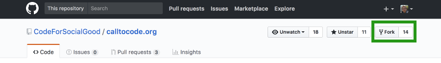
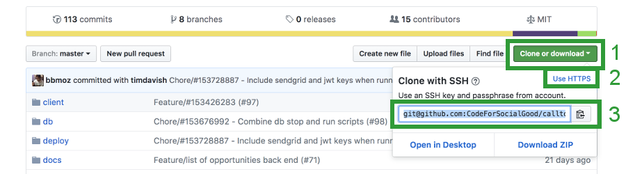
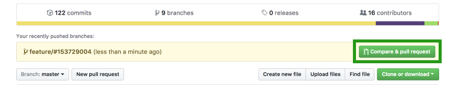
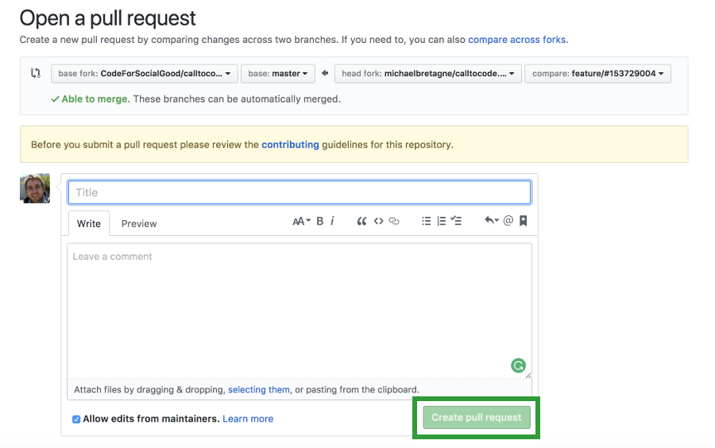
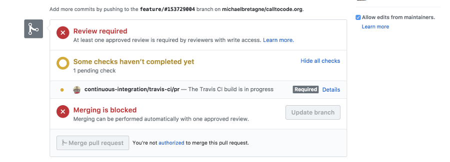

## Contributing to open source project

Each project usually has their own **contributing.md** file, please check the README.md file for any specificities.

For the purpose of this guide, I will use a project that I have contributed in the past call **calltocode.org** from **CodeForSocialGood github**.
I will create a new branch that will be used to add a new feature of the project to encrypt passwords by performing the following **9 procedures**:


#### 1. Fork the project

In the GitHub project page press the "fork" button on the top right of the page to create a new repo on your GitHub account.




#### 2. Clone your new repo into your workspace

> It is recommended to setup ssh. Please [add a new SSH key to your GitHub account](https://help.github.com/articles/adding-a-new-ssh-key-to-your-github-account/).

On the GitHub project page, click on the green “Clone or download” button.
Then click on the blue link “Use SSH” and copy the SSH key that we will use in the next command.



In your terminal:
```bash
$ cd ~
$ mkdir -p workspace && cd workspace
$ git clone git@github.com:CodeForSocialGood/calltocode.org
$ cd calltocode.org
```


#### 3. Setup a new remote

Now that you have the repo on your local machine, you need to add a new remote that points to the original project.
This step will allow you to grab any changes from the original project and bring them into your local copy.

```bash
$ git remote add upstream git@github.com:CodeForSocialGood/calltocode.org
```

Verify the remotes of your forked repo
```bash
$ git remote -v
```

You should have two remotes for this project:

* **origin** which points to your GitHub fork of the project. You can read and write to this remote.
* **upstream** which points to the main project's GitHub repository. You can only read from this remote.


#### 4. Create a new branch

> When you start new work, I recommend to always create a new branch.

Check that you are in the master branch

```bash
$ git checkout master
```

Pull any changes from the original project and push them to the forked project

```bash
$ git pull upstream master && git push origin master
```

Create a new branch

> I try to follow the specific **naming convention** of the project that I am contributing.
> In this example, I will use an often use convention in the open source projects.

```bash
$ git checkout -b feature/encrypt-password
```


#### 5. Do your work

Only work on one task at the time. Do not modify anything else than what is needed for the task.


#### 6. Push your changes to your GitHub repo

> Depending on the task, you might need to create multiples commit to breaks down your work.

Check which files has been changed
```bash
$ git status
```

Add all the files you changed
```bash
$ git add .
```

> Check the naming convention of your project to make sure that it follows the rules of the commit messages.

Commit your changes
```bash
$ git commit -m "Feature: encrypt passwords"
```

Push your new branch to GitHub
```bash
$ git push -u origin feature/encrypt-password
```


#### 7. Create a pull request

Now that your changes are updated on your GitHub repo, you can create to pull request to submit your work to the maintainers.

In Github, press the green "compare & pull request" button.



In the "Open a pull request" page, add a title and a description of your work in the dedicated inputs and press the green "Create pull request" button.

> Ensure that the "base fork" points to the correct repository and branch.




#### 8. Wait for approval / Make the requested changes

Now that you created a pull request, you will need to wait for the team leaders to check your work.

You can see the status of your pull request directly in the pull request section of the original project page.

They might request changes on the pull request. If so, make the changes and repeat the step 5.



Once you pushed your changes, you can update your PR.
On Github, in the pull request section of the original project page, press the "Update branch" button.

Your work will once again be reviewed by the maintainers.

If your PR is accepted it will be directly merged by the authorized person of the project.

Good job! You are almost done.


#### 9. Merge your branch into your forked project

> Make sure your PR has been accepted before merging your branch

Switch to the master branch
```bash
$ git checkout master
```

Merge your branch
```bash
$ git merge feature/encrypt-password
```

Delete the branch that you will not be using anymore
```bash
$ git branch -d feature/encrypt-password
```


Congratulations! You have successfully contribute to an open source project!
